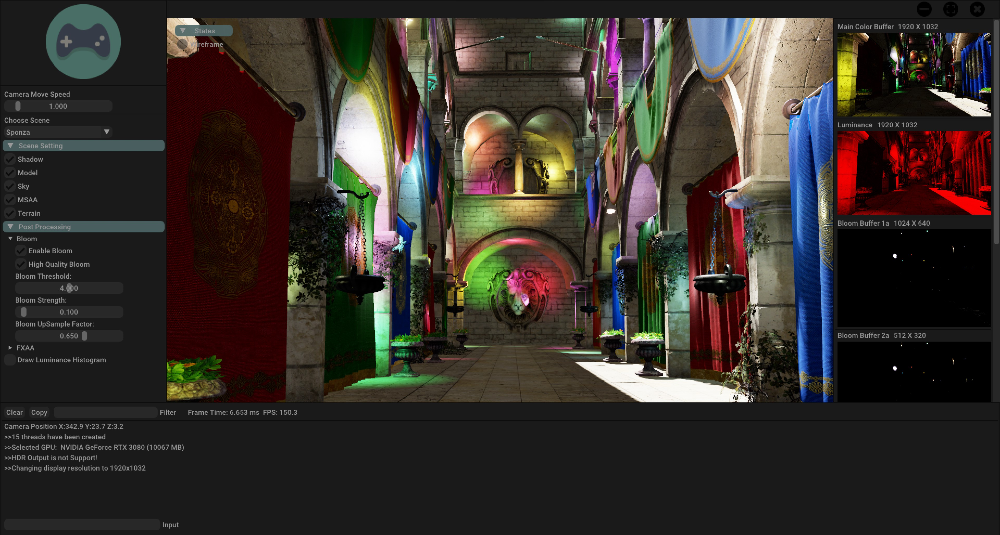
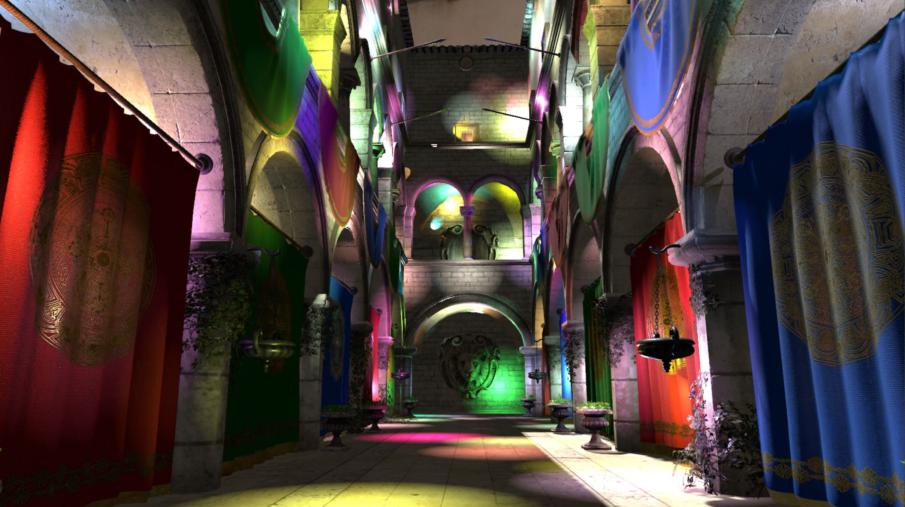
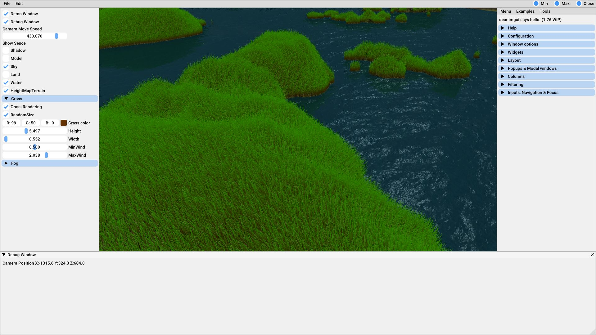
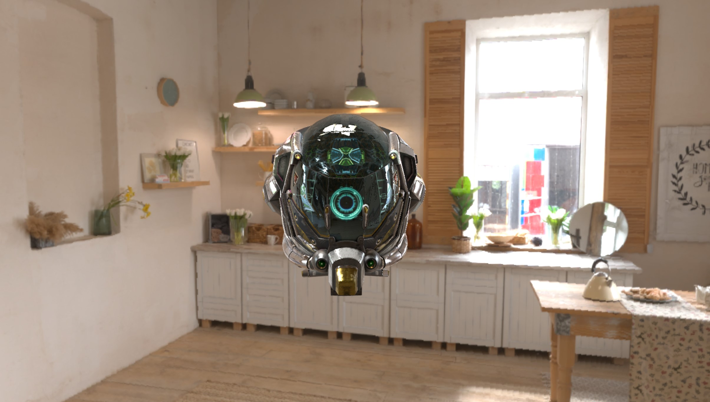
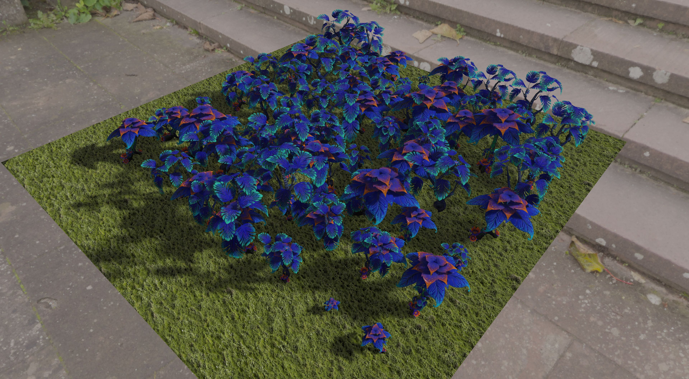
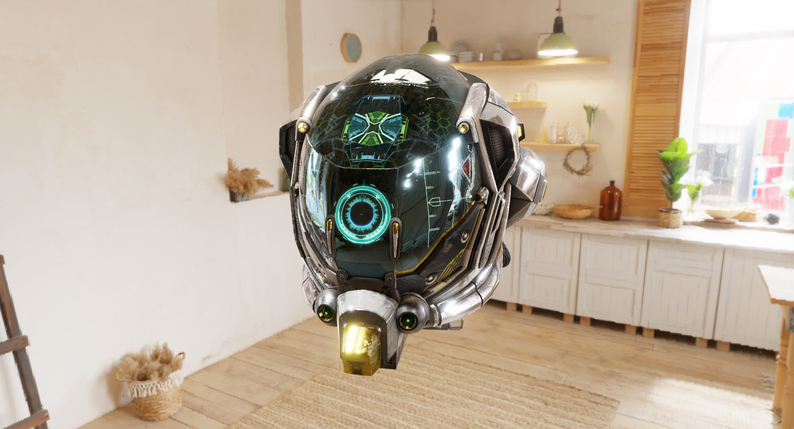
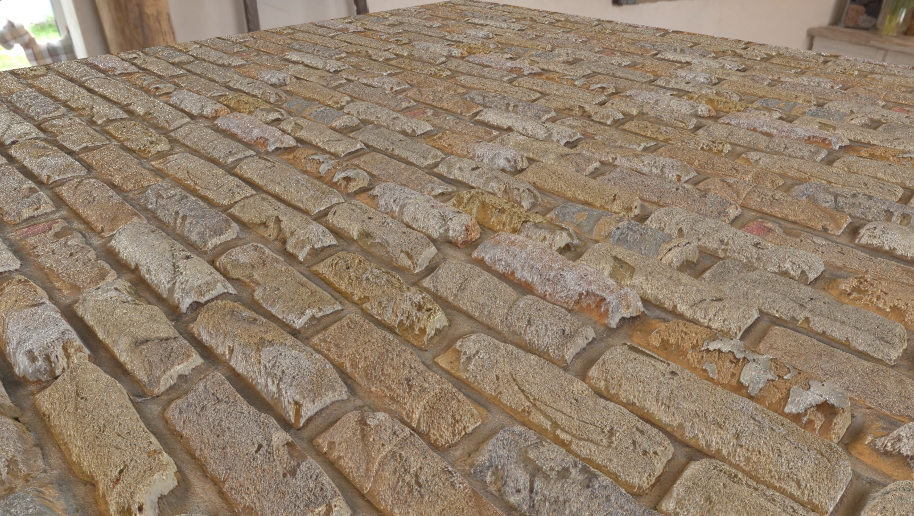
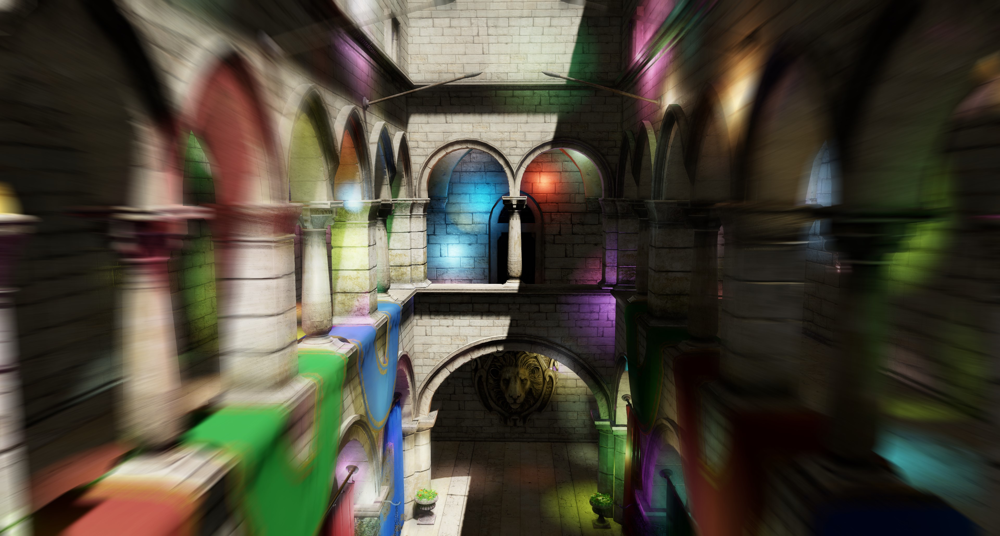

# Glare Engine
Glare Rendering Engine  use DirectX12

Suggest Environment : Win11 VS2022 or JetBrains Rider

TIPS: 

1.If the scene becomes dark, there may be a problem with the shader compilation. It is recommended to change the shader model in CMakeLists(GlareEngine->CMakeLists) from 6.0 to 5.1. It is recommended to update to a stable GPU driver

## Features
- Image-based lighting
- Tiled Base Forward Rendering,Tiled Base Deferred Rendering 
- Cluster Base Deferred Rendering
- Cook-Torrance microfacet specular BRDF
- Metallic workflow
- Normal mapping
- Point lights, spot lights, directional light
- PCSS, PCF shadows
- Screen-space ambient occlusion
- HDR bloom
- Color grading: exposure, adaptation
- TAA, FXAA, MSAA
- Parallax Mapping
- Motion Blur
- Runtime Shader Modify

## Examples

Editor

Forward Plus (2.5d Tiled Base Forward)

Grass and Water

PBR BRDF Mode

PCSS

Bloom

Parallax Mapping

Motion Blur

